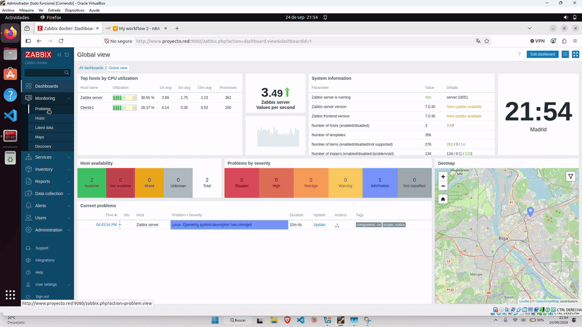
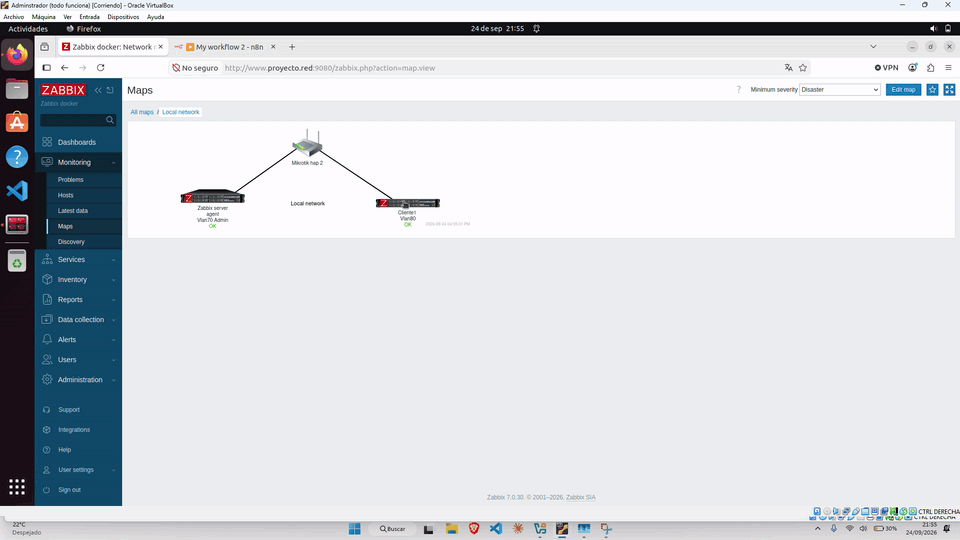
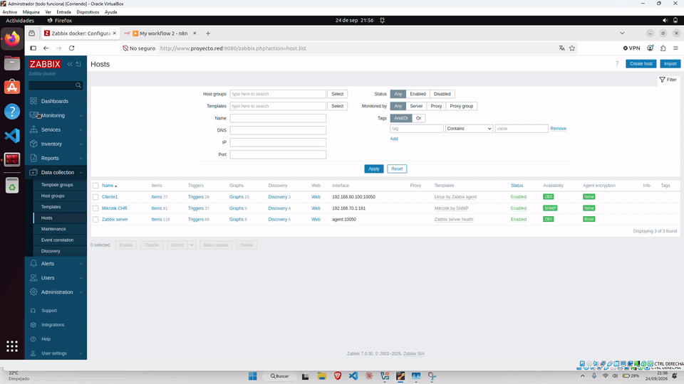
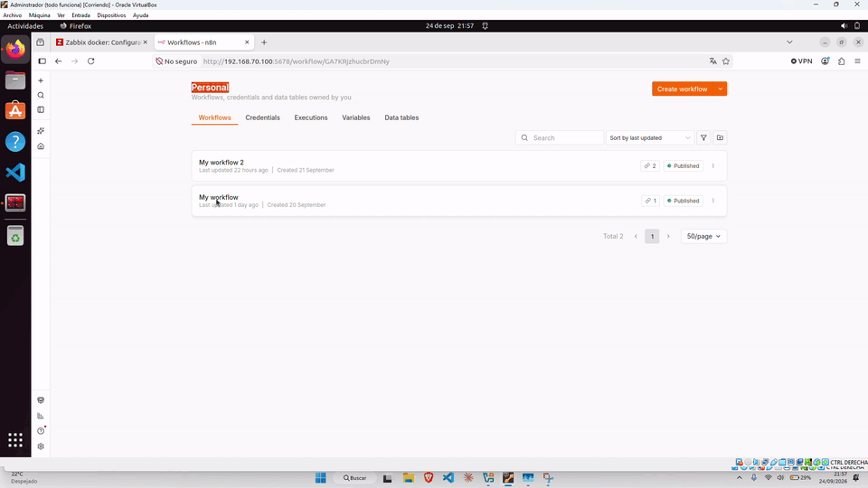
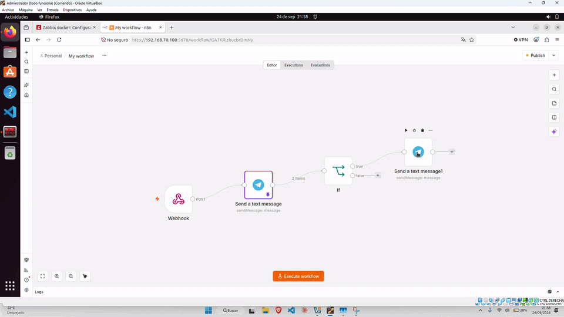
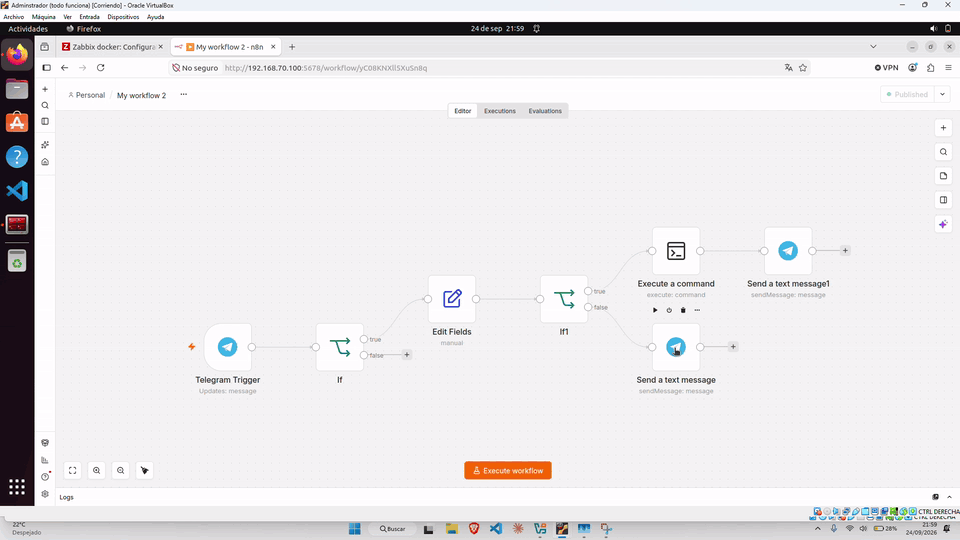
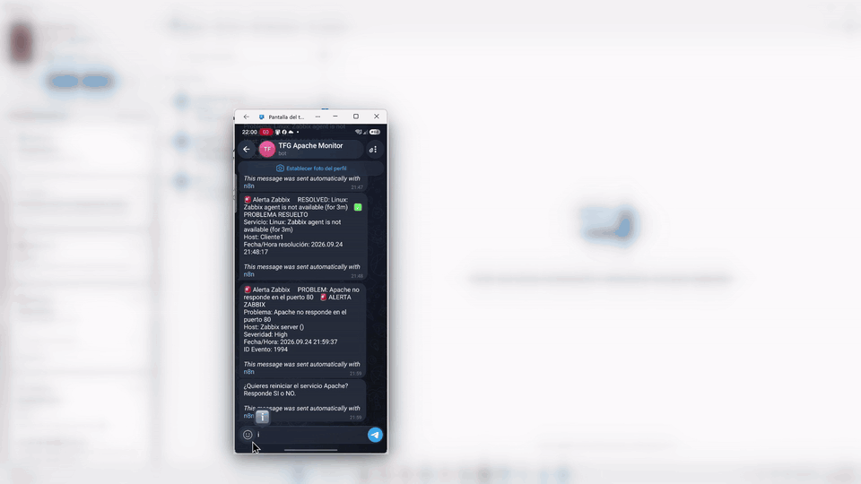

# Monitorización automática de infraestructura con Zabbix, n8n y Telegram

Sistema de monitorización de infraestructura que vigila servicios, red y tráfico del servidor. Zabbix detecta las incidencias, n8n automatiza los avisos y Telegram permite recibir alertas y responder a ellas sin conectarse manualmente por SSH.

## Demo

En el ejemplo de Apache, el bot avisa cuando el servicio deja de responder y pregunta si se desea reiniciarlo. Si se confirma, n8n ejecuta la acción remota y Zabbix notifica la recuperación. El flujo se puede adaptar a otros hosts y servicios.

## Stack tecnológico

| Componente | Función |
| --- | --- |
| **Zabbix (Docker)** | Monitorización de infraestructura y detección de problemas en servicios, agentes Linux y red |
| **n8n (Docker)** | Orquestación de los workflows: webhook de Zabbix, formato de alertas, Telegram y acciones de respuesta |
| **Docker Compose** | Despliegue y aislamiento de Zabbix y n8n |
| **Telegram Bot API** | Canal de alertas y control remoto |
| **Apache / Ubuntu Server** | Servicio de ejemplo monitorizado |
| **MikroTik CHR** | Monitorización de conectividad e interfaces de red |

## Qué vigila

- **Servicios**, como Apache: detección de caída y recuperación, con opción de solicitar un reinicio remoto por Telegram.
- **Red MikroTik**: disponibilidad de hosts e interfaces, con alertas que identifican el elemento afectado.
- **Tráfico sospechoso hacia el servidor**: detección de peticiones anómalas o abusivas y aviso para facilitar la intervención.

## Cómo funciona: recuperación de Apache

1. **Detección:** Zabbix detecta que Apache no responde en el puerto 80 y activa un trigger de severidad alta.
2. **Envío:** Zabbix lanza un webhook hacia n8n.
3. **Notificación:** n8n prepara el mensaje y lo envía al bot de Telegram *TFG Apache Monitor*.
4. **Decisión:** el bot pregunta si se desea reiniciar el servicio y espera una respuesta `SI` o `NO`.
5. **Acción remota:** si se responde `SI`, n8n ejecuta el reinicio del servicio vía SSH.
6. **Confirmación:** Zabbix detecta la recuperación y el bot informa del resultado (`RESOLVED`).

Las alertas de MikroTik y de tráfico sospechoso siguen el mismo patrón de notificación —Zabbix → n8n → Telegram— y adaptan el mensaje y la acción disponible al tipo de incidencia.

## Capturas

Las siguientes capturas animadas muestran el dashboard y mapa de Zabbix, los hosts monitorizados, los workflows de n8n y las notificaciones en Telegram.

### Zabbix

### n8n

### Telegram

## Contexto

Proyecto desarrollado como parte del **Técnico Superior en Administración de Sistemas Informáticos en Red (ASIR)**. Aplica monitorización proactiva y automatización de la respuesta ante incidencias, prácticas habituales en soporte IT y administración de sistemas.

## Próximos pasos

- Añadir monitorización de servicios adicionales, como MySQL y Nginx.
- Monitorizar el estado de los propios contenedores de Docker (Zabbix y n8n).
- Ampliar la detección de tráfico sospechoso con reglas adicionales.
- Desplegar n8n y el bot en un servidor dedicado, fuera del laboratorio.
- Documentar el proceso de despliegue paso a paso.

## Autor

**Adil Bentaleb** · [LinkedIn](https://linkedin.com/in/adil-bentaleb-83472a209) · [Portfolio](https://bentaleb-adil.pages.dev/) · [GitHub](https://github.com/bentalebadil158-stack)
